<!-- hero: animated contribution graph -->
<h3><code>ommprakash@github ~ $ ./contributions.sh</code></h3>

 
 

<!-- hero: monochrome ASCII portrait beside a neofetch-style info panel -->
<h3><code>ommprakash@github ~ $ whoami</code></h3>

<table style="border: none; background: transparent;">
<tr>
<td valign="top" style="border: none; background: transparent;"></td>
<td valign="top" style="border: none; background: transparent;"></td>
</tr>
</table>

 
 

<h3><code>ommprakash@github ~ $ ./links.sh</code></h3>

<b>AI Automation & Solutions Engineer | LLMs | RAG</b>

&nbsp;&nbsp;&nbsp;&nbsp;

&nbsp;&nbsp;&nbsp;&nbsp;

  

<!-- Restored original stats badges -->

---

 

<table width="100%" style="border-collapse: collapse;">
<tr>
<td width="100%" valign="top" bgcolor="#0D1117" style="padding: 1px; border: 1px solid #30363D; border-radius: 8px;">
<h3 style="margin-top: 5px; color: #E6EDF3;">🚀 AI Engineer & Solutions Specialist</h3>
Building AI-powered systems, automation workflows, and production RAG pipelines that optimize business operations. Combining software engineering foundations with product thinking to deliver clear efficiency gains.

&nbsp;&nbsp;&nbsp;

</td>
</tr>
</table>

 

<table width="100%" style="border-collapse: collapse;">
<tr>
<td width="100%" valign="top" bgcolor="#0D1117" style="padding: 1px; border: 1px solid #30363D; border-radius: 8px;">
<pre style="margin: 0; padding: 10px; background: transparent; border: none; font-family: monospace; color: #8B949E; font-size: 13.5px; line-height: 1.5;">Focus Areas:
  • AI Engineering & RAG Architectures
  • Workflow Automation & Agentic Systems
  • Product-Oriented Solutions Engineering

Active Stack:
  • Python / LangChain / ChromaDB / FastAPI / React

Target Roles:
  • AI Engineer / Solutions Engineer / AI Automation Specialist

Location:
  • Bangalore, India (Open to Relocation / Remote)</pre>
</td>
</tr>
</table>

 

<table width="100%" style="border-collapse: collapse;">
<tr>
<td width="48%" valign="top" bgcolor="#0D1117" style="padding: 1px; border: 1px solid #30363D; border-radius: 8px;">

<b>Problem:</b> Organizations struggle to securely retrieve insights from documents without cloud data leaks. <b>Solution:</b> Developed a local offline RAG system using LangChain, Groq-hosted Llama 3, and FAISS. <b>Outcome:</b> Achieved <b>&lt;1.5s query latency</b> and <b>94% accuracy</b> under offline conditions.

</td>
<td width="4%"></td>
<td width="48%" valign="top" bgcolor="#0D1117" style="padding: 1px; border: 1px solid #30363D; border-radius: 8px;">

<b>Problem:</b> Compiling researched long-form materials manually takes hours of formatting and drafting. <b>Solution:</b> Designed an autonomous content agent using Python, Playwright web-scrapers, and ChromaDB. <b>Outcome:</b> Automated full draft generation and markdown formatting into a <b>single CLI execution</b>.

</td>
</tr>
<tr><td colspan="3" height="20"></td></tr>
<tr>
<td width="48%" valign="top" bgcolor="#0D1117" style="padding: 1px; border: 1px solid #30363D; border-radius: 8px;">

<b>Problem:</b> CCTV trackers lose player identities across disparate camera views, causing tracking swaps. <b>Solution:</b> Built a spatial-temporal computer vision pipeline with YOLOv8, OpenCV, and PyTorch. <b>Outcome:</b> Achieved <b>92% identity retention accuracy</b> across multi-angle camera feeds.

</td>
<td width="4%"></td>
<td width="48%" valign="top" bgcolor="#0D1117" style="padding: 1px; border: 1px solid #30363D; border-radius: 8px;">

<b>Problem:</b> Online learning management systems lack custom student pacing and feedback loops. <b>Solution:</b> Constructed an interactive Next.js tutoring dashboard integrated with Docker. <b>Outcome:</b> Implemented real-time performance tracking and contextualized study pathways.

</td>
</tr>
</table>

 

<table width="100%" style="border-collapse: collapse;">
<tr>
<td width="48%" valign="top" bgcolor="#0D1117" style="padding: 1px; border: 1px solid #30363D; border-radius: 8px;">

Active log of LLM engineering, prompt pipeline designs, and vector retrieval mechanics.

</td>
<td width="4%"></td>
<td width="48%" valign="top" bgcolor="#0D1117" style="padding: 1px; border: 1px solid #30363D; border-radius: 8px;">

Consistent daily building of script automation pipelines, CLI applications, and data tasks.

</td>
</tr>
</table>

 

<table width="100%" style="border-collapse: collapse;">
<tr>
<td width="48%" valign="top" bgcolor="#0D1117" style="padding: 1px; border: 1px solid #30363D; border-radius: 8px;">

</td>
<td width="4%"></td>
<td width="48%" valign="top" bgcolor="#0D1117" style="padding: 1px; border: 1px solid #30363D; border-radius: 8px;">

</td>
</tr>
<tr><td colspan="3" height="20"></td></tr>
<tr>
<td width="48%" valign="top" bgcolor="#0D1117" style="padding: 1px; border: 1px solid #30363D; border-radius: 8px;">

</td>
<td width="4%"></td>
<td width="48%" valign="top" bgcolor="#0D1117" style="padding: 1px; border: 1px solid #30363D; border-radius: 8px;">

</td>
</tr>
<tr><td colspan="3" height="20"></td></tr>
<tr>
<td colspan="3" valign="top" bgcolor="#0D1117" style="padding: 1px; border: 1px solid #30363D; border-radius: 8px;">

</td>
</tr>
</table>

 

<table width="100%" style="border-collapse: collapse;">
<tr>
<td width="100%" valign="top" bgcolor="#0D1117" style="padding: 1px; border: 1px solid #30363D; border-radius: 8px;">
<table width="100%" style="border: none; border-collapse: collapse;"><tr><td width="48%" valign="top"><h4 style="margin-top: 0; color: #F59E0B;">🎓 EDUCATION</h4><ul style="color: #8B949E; font-size: 13.5px; padding-left: 20px; line-height: 1.6; margin-bottom: 0;"><li><b>B.Tech in Computer Science</b> GIET University (2021 - 2025)</li><li>Focus: Software Engineering & Core Foundations</li></ul></td><td width="4%"></td><td width="48%" valign="top"><h4 style="margin-top: 0; color: #0EA5E9;">📜 KEY CERTIFICATIONS</h4><ul style="color: #8B949E; font-size: 13.5px; padding-left: 20px; line-height: 1.6; margin-bottom: 0;"><li><b>ChatGPT Prompt Engineering</b> &bull; DeepLearning.AI & OpenAI</li><li><b>Microsoft Azure AI Essentials</b> &bull; Microsoft</li><li><b>Technical Sim Certification</b> &bull; Deloitte</li></ul></td></tr></table>
</td>
</tr>
</table>

 

<table width="100%" style="border-collapse: collapse;">
<tr>
<td width="100%" valign="top" bgcolor="#0D1117" style="padding: 1px; border: 1px solid #30363D; border-radius: 8px;">
<table width="100%" border="0" cellpadding="0" cellspacing="0" style="border-collapse: collapse; border: none;"><tr><td width="50%" align="center" style="padding: 5px; border: none;"></td><td width="50%" align="center" style="padding: 5px; border: none;"></td></tr></table>
</td>
</tr>
</table>

 

<table width="100%" style="border-collapse: collapse;">
<tr>
<td width="100%" valign="top" bgcolor="#0D1117" style="padding: 1px; border: 1px solid #30363D; border-radius: 8px;">

</td>
</tr>
</table>

 

<table width="100%" style="border-collapse: collapse;">
<tr>
<td width="100%" valign="top" bgcolor="#0D1117" style="padding: 1px; border: 1px solid #30363D; border-radius: 8px;">
<picture><source media="(prefers-color-scheme: dark)" srcset="https://raw.githubusercontent.com/OmmprakashMohanty01/OmmprakashMohanty01/output/github-contribution-grid-snake-dark.svg"/><source media="(prefers-color-scheme: light)" srcset="https://raw.githubusercontent.com/OmmprakashMohanty01/OmmprakashMohanty01/output/github-contribution-grid-snake.svg"/></picture>
</td>
</tr>
</table>

 

<table width="100%" style="border-collapse: collapse;">
<tr>
<td width="100%" valign="top" bgcolor="#0D1117" style="padding: 1px; border: 1px solid #30363D; border-radius: 8px;">
<h3 style="color: #E6EDF3;">Get in Touch</h3>
Open to discussions regarding AI integration, workflow automation, and solutions engineering opportunities.
&nbsp;&nbsp;&nbsp;&nbsp;
</td>
</tr>
</table>

  

